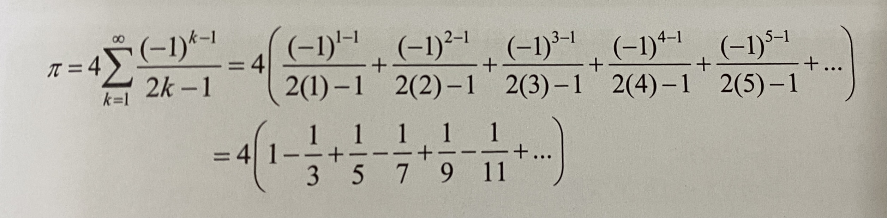

# 範例一 repeat_printing
## 列印x字元y次
```c
void repeat_printing(char, int);

int main()
{

    char ch;
    int i;
    printf("Please enter a character to be printed: ");
    scanf("%c", &ch);
    printf("How many characters do you want to print? ");
    scanf("%d", &i);

    repeat_printing(ch, i);
    return 0;
}

void repeat_printing(char C, int I)
{
   int x;
   for(x = 1; x <= I; x++)
   {
       printf("%c", C);
   }
}
```
注: 不同函數中，可使用相同的變數名稱數名稱

# 範例二
## 絕對值
```c
int abs(int);

int main()
{
    printf("Please enter a number ");
    int num1;
    scanf("%d", &num1);

    int abs_num = abs(num1);
    printf("%d", abs_num);

    return 0;
}

int abs(int num1)
{
    if(num1<0)
    {
        return num1 = -num1;

    }
    else
        return num1;
}
```
# 範例三
## n次方

```c
int main()
{
    int base; 
    int p;

    printf("Enter Base and Power");
    scanf("%d %d", &base, &p);
    int total = power(base, p);
    printf("%d", total);

}


int power(int base, int p)
{
    int i, total = 1;         /*注意total = 1*/
    for(i = 1; i <= p; i++)
    {
        total = total * base; /*重點*/
    }
    return total;
}

```

# 範例四
## 質數測試
prime number: 除了1及他自己本身，沒有其他數字能整除他。  
由定義推得，所以只須找到非1, 非自己本身且小於自己的數，且又可以整除他，就可以代表他不是prime number. 如8 找到2, 4。
```c
int is_prime(int);

 main()
{   
    int n;
    printf("Enter a number: ");
    scanf("%d", &n);
    if(is_prime(n))
        printf("%d is prime number", n);
    else
        printf("%d is not prime number", n);
}
int is_prime(int num)
{
    int i;
    for(i = 2; i<num; i++)  /*i = 2, 因為除了1及小於自己本身的數*/
    {
        if(num % i == 0)    /*可以整除*/
            return 0;
        else
            return 1;
    }    
        
}
```
# 範例五 函式之間的呼叫
## Leinbiz 發現的公式(估算pi值)

