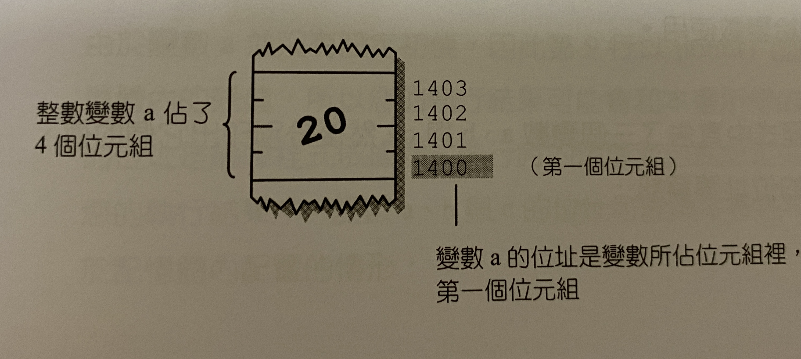
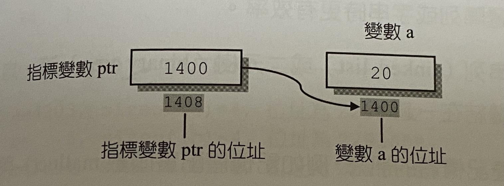

# 1. Pointer概述
指標可以存取變數的值，就像是利用變數名稱存取變數內容。  
**特殊的變數**，用來存放變數在**記憶體中的位址**  
Address(位址): when we declare a variable, the compiler will assign a memory space with **unique number** called "address" to it.
- 不論指標變數所指向之變數的型態為何，編譯器都會給它**4個位元組**。
## 1.1 依址取值(adress -> variable value)
當指標ptr指向變數a之後，如果要存取變數a時，便可利用指標ptr找到變數a的address，再由該位址取出所儲存的變數值。  
```
指標ptr指向變數a (ptr存放的是 adress of a)
```
宣告一個變數a，值為20，ptr存放a的adress(1400)。compiler也會安排adress給指標變數(1408)

## 1.2 位元組定址法
決定變數的位址，也就是給予記憶體內的每個位元組一個adress，而**變數的adress即是它所佔的位元組裡，第一個位元組的位址**，如下圖。


## 1.3 為甚麼使用指標?
1. 使函數在傳遞陣列或字串更有效率
2. 較複雜的資料結構，如linked list, binary tree，需透過pointer協助，才能將資料連接再一起。
3. 函數需要pointer傳達記憶體訊息，例如malloc(), fopen()。

# 記憶體的位址
 %d 十進位表示位址  
 %p 十六進位表示位址
 
 # 2. 指標變數的使用
 
 ## 2.1 指標變數的宣告  
 ```
 1. data_type *pointer variable
 
 2. data_type* pointer variable
 ```
 "*"將普通變數變成指標變數。  
 data_type 為指標所指向之變數的型態。  
 第二種方法可以看成: int*為一個新的形態(指向整數的指標型態)
 ### 範例一 
 ```c
 int num = 20;
 int *ptr;       /*宣告 一個指向integer的pointer_variable, ptr*/
 ptr = &num;     /*把num的位址(&num)assign to ptr/
 
 /*Declare pointer_variable and assign value to pointer at the same time*/
 int num = 20;
 int *ptr = &num;
 ```
 

 ### 範例二 同時宣告2個指標變數
 ```
 int* ptr1,ptr2;
 int *ptr1, *ptr2;
 ```
 
 
## 2.2 & and *
 1. 位址運算子 &
 - 取出**變數位址**
 - 範例: &num (取出num的位址)

 2. 依址取址運算子 *
 - 取出指標變數所指向的**變數內容**
 - 範例: *ptr = &num 


### 範例一
```c
int main()
{
    int a = 20, *ptr;
    ptr = &a;
    printf("a = %d, &a = %p\n", a, &a); /*列印出a值，a的位址*/
    printf("*ptr = %d, ptr = %p, &ptr = %p", *ptr, ptr, &ptr);

    return 0;
}
```

### 範例二 更改一個相同型態的指向對象
注意!!! 僅限於**相同型態**。
```c
int main()
{
    int a = 5, b = 3;
    int *ptr;
    
    ptr = &a; /*ptr指向a*/
    printf("&a = %p, &ptr = %p, *ptr = %d\n", &a, &ptr, *ptr);
    
    ptr = &b; /*更改指向對象為b*/
    printf("&b = %p, &ptr = %p, *ptr = %d\n", &b, &ptr, *ptr);
}
```  
# 宣告指標變數所指向之型態的重要性
- 一旦宣告指標變數指標變數所指向的型態後，便不能更改。
- 不可把A型態的指標指向B型態的變數。
- 
### 範例一 錯誤 分配錯誤的資料型態
```c
int a = 10, *ptri;
float b = 1.5, *ptrf;

ptri = &b; /*Error, 將指向int的pointer指向float!!!*/
ptrf = &a; /*Error, 將指向float的pointer指向int!!!*/
```
### 3. 指標與函數
## 3.1 把指標傳入function裡
```
return_type function_name (data type *pointer)
{
    /*body*/
}
```
### 範例一 接收一個指向整數指標變數的function(也就是可以接收一個整數變數的位址)
address()
```c
void address(int *); /*prototype中不必變數名稱，*表示接收的是pointer*/

int main()
{
    int a=12;
    int *ptr = &a;
    
    address(&a); /*傳入位址*/
    address(ptr);/*傳入位址*/
}

void address(int *p1)  /* *p1=&a; p1 = ptr */
{
    printf("位於address: %p , 儲存的變數為%d\n", p1, *p1);
}
```
### 範例二 透過傳遞位址來改變原本的內容
透過傳遞a的位址，來改變a的值(a+10)
```c
void add10(int *);

int main()
{
    int a=5;
    printf("before calling add10(), a = %d\n", a);
    
    add10(&a); /*傳入a的位址*/
    
    printf("after calling add10(), a = %d\n", a);
    
}

void add10(int *p1) /* p1 = &a */
{
    *p1 = *p1 + 10;  /*直接在a的記憶體中上修改, 所以不用return*/
}
```

### 範例三 swap a, b值 錯誤版
```c
void swap(int, int);

int main()
{
    int a=5, b=100;
    printf("before calling swap(), a = %d, b = %d\n", a, b);
    
    swap(a, b);
    printf("after calling swap(), a = %d, b = %d\n", a, b);
    
}

void swap(int x, int y)
{
    int temp = x;
    x = y;
    y = temp;
}
```
為甚麼錯誤呢? 因為在swap()裡，x,y 屬於local variable，當swap()執行結束時，x,y的值即從記憶體空間抹除，main()中a, b值根本沒有改變。  
### 範例三之一 swap a, b值 正確版
解決方法: 直接在記憶體上修改。
```c
void swap(int *, int *);

int main()
{
    int a=5, b=100;
    printf("before calling swap(), a = %d, b = %d\n", a, b);
    
    swap(&a, &b); 
    printf("after calling swap(), a = %d, b = %d\n", a, b);
    
}

void swap(int *x, int *y) 
{
    int temp = *x;
    *x = *y;
    *y = temp;
}
```
### 3.2 由function傳出pointer  
回傳一個 **指向int的指標**
- int *func(....);  
- int* func(....);
```c
int *max(int*, int*);

int main()
{
    int a = 12, b = 17, *ptr;
    ptr = max(&a, &b);
    printf("max = %d\n", *ptr);

    return 0;
}

int *max(int *p1, int *p2) /* 回傳一個 指向int的指標*/
{
    if(*p1>*p2)
        return p1; /*回傳pointer(變數位址)到main()*/
    else
        return p2;
}
```
# 4. 指標與一維陣列
- Array_name是**指標常數(pointer constant)**，用來存放**陣列第一個元素的位址**。
- **非指標變數**，因為我們不能更改其的指向，因此為**pointer constant**
## 4.1 指標的 arithmetic operation(算術運算)
- 指標內所存放的**位址**做加減法運算。
- 針對它所指的資料型態的大小處理，例如:   
 - ptr 指向一個**整數**，則 ptr + 1 ，表示**+4個byte**，並不是表示將位址的值+1。
 - ptr 指向一個**字元**，則 ptr - 1 ，表示**-1個byte**。
- 常用在存取陣列元素上。
### 範例一 利用pointer constant存取陣列內容 *(a+i)
```c
int a[3] = {5, 7, 9};
printf("a[0] = %d, *(a+0) = %d\n", a[0], *(a+0)); 
printf("a[1] = %d, *(a+1) = %d\n", a[1], *(a+1));
printf("a[0] = %d, *(a+2) = %d", a[2], *(a+2));

return 0;
```

### 範例二 
```c
int main()
{
    int a[3] = {1, 2, 3};
    int i, sum=0;
    int *ptr = a; /*指向a[0]*/
    
    for(i=0; i<3; i++)
        sum += *(ptr++);  
        
    printf("sum = %d", sum);

    return 0;
}
```
ptr = ptr + 1

# 利用指標傳遞一維陣列到函數裡
SYNTAX
```
傳回值型態 函數名稱(資料型態 *陣列名稱(用來接收一維陣列的位址)){...}

void func(int *arr)
```
### 範例一
```c
void replace(int *, int, int);
int main()
{   
    int a[5] = {1, 3, 5, 7, 9};
    int i, num = 99;
    
    replace(a, 4, num); /*將陣列a裡的第4個元素換成num(99)*/
    printf("After replacing: int a[5] = ");
    for(i=0; i<5; i++)
        printf("%d ", a[i]);
    return 0;
}
void replace(int *ptr, int n, int num) /* *ptr接收a陣列的位址，然後直接從記憶體中修改值*/
{
    *(ptr + n - 1) = num;
}
```
### 範例二 函數傳回指標型態的變數
在函數名稱前加上 *
```c
int *maximum(int *);
int main()
{   
    int a[5] = {1, 3, 5, 7, 9};
    int i, *ptr;
    
    printf("array a = ");
    for(i=0; i<5; i++)
        printf("%d ", a[i]);
    ptr = maximum(a);        /*傳入陣列a到maximum()*/
    printf("\nmaximum = %d", *ptr);    
    return 0;
}
/*接收位址，傳回位址*/
int *maximum(int *arr) /* *arr接收a陣列的位址*/
{
    int i,*max;        /*傳回去*/
    max = arr;         /*指標max指向a[0]*/
    for(i=1; i<5; i++)
        if(*max < *(arr+i))
            max = arr+i;
    return max;  
    
}
```
